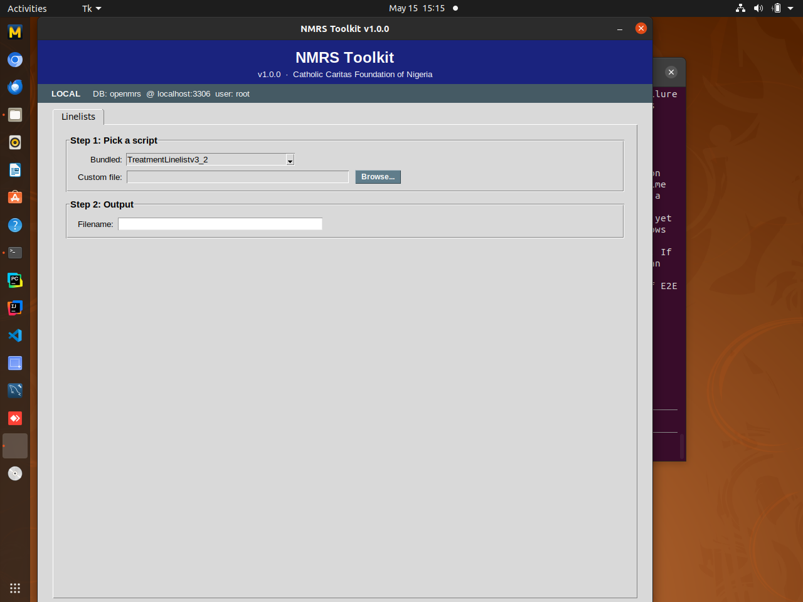

# NMRS Toolkit

NMRS Toolkit is a cross-platform desktop application built to support program data managers and M&E teams working with exports from the Nigeria Medical Record System (NMRS). It automates routine data tasks — line list generation, indicator reporting, and configuration-driven processing — replacing fragile spreadsheet workflows with a reproducible, auditable tool.

Originally developed around HIV program workflows, the toolkit is being extended to accommodate additional disease areas, and an integrated analytics dashboard is in progress to deliver cohort, outcome, and trend analyses on demand without moving sensitive patient data into external BI tools.



## Features

- Process Nigeria Medical Record System (NMRS) exports into structured outputs
- Automated line list generation — 5 bundled linelists (Treatment, PMTCT, EAC, OTZ, AHD) plus any custom `.sql`
- **Weekly linelist batch** — generates Treatment, PMTCT, EAC, and AHD in one click, or automatically at 00:00 every Thursday (and on the next startup if the machine was off); written to `~/NMRS_Linelists` (`C:\NMRS_Linelists` on Windows)
- Configuration-driven processing via `.nmrs_config.ini`
- **Daily encrypted database backups** — runs at 00:00 Mon-Fri and on system startup; gzip + AES-GCM per-facility key; configurable retention
- **Database restore** with pre-restore safety backup, typed-name confirmation, and live byte-level progress
- Packaged as a standalone desktop application (Ubuntu build available)

## Roadmap

- In-app analytics dashboard (cohort, treatment outcome, and trend analyses)
- Expansion beyond HIV to additional disease areas
- Cross-platform packaging (Windows, macOS)

## Installation

### Option 1 — Prebuilt binary (Ubuntu)

Download the latest `NMRSToolkit_Ubuntu_v1_0_0.zip` from the releases, extract it, and run the executable.

### Option 2 — From source

Requirements: Python 3.8+, and (Linux) the system GTK + WebKit2 runtime for the
desktop window — `sudo apt install gir1.2-webkit2-4.0 python3-gi`.

```bash
git clone https://github.com/Adeyemicodes/NMRS_Toolkit.git
cd NMRS_Toolkit
pip install -r requirements.txt
python -m nmrs_toolkit                     # GUI
python -m nmrs_toolkit --backup            # headless backup pass (used by cron)
python -m nmrs_toolkit --generate-linelists  # headless weekly linelist batch
```

## Architecture (v2)

The desktop UI is an HTML/CSS/JS frontend rendered in a native **PyWebView**
window, talking to the Python backend through a small JSON bridge. The app stays
fully **local and offline-first**: a Content-Security-Policy blocks all network
egress (`connect-src 'none'`), every asset is bundled, and there is no telemetry
or auto-update. The headless `--backup` / `--generate-linelists` entry points
import no UI code, so the OS scheduler runs them on a display-less machine.

All workflows emit through a single **AppLogger**. On-disk forensic logs:

| File | Contents |
|------|----------|
| `~/.nmrs_toolkit/application.log` | every event, all categories (rotated 10 MB × 3) |
| `~/NMRS_DB/backup.log` | backups |
| `~/NMRS_DB/restore.log` | restores |
| `~/NMRS_Linelists/linelist.log` | linelist runs |

(On Windows the `NMRS_DB` / `NMRS_Linelists` folders live under `C:\`.) Secrets
(`backup_key`, `master_secret`, `admin_password`, any DB password) are redacted
before any line is written. The in-app **Activity Log** drawer tails, filters,
searches, and exports these logs.

## Analytics Dashboard

The **Dashboard** tab turns the Treatment line list into PEPFAR-style program
indicators — Ever Enrolled, TX_NEW, TX_CURR, Currently IIT (with duration
breakdown), TX_ML, TX_RTT, the VL cascade, MMD share, an age/sex pyramid, and
biometric coverage — each disaggregable by sex / age / sex×age and rendered with
Chart.js (vendored locally; no CDN). It reads the most recent
`Treatment_*.csv` in `NMRS_Linelists/`; changing the date range recomputes
instantly in memory (no DB). Snapshot indicators are stamped **"as of &lt;end&gt;"**
and period-flow indicators **"Period: &lt;start&gt; to &lt;end&gt;"** so the two
are never confused. Clinical status is recomputed from raw columns and mirrors
`scripts/TreatmentLinelistv3_2.sql` exactly (validated against the real
`CurrentARTStatus` column).

**"Refresh from DB"** regenerates the line list at the chosen end date (passed as
`@endDate`) for an exact historical snapshot.

> ⚠️ **Dashboard exports are NOT current line lists.** Per-indicator and
> "Export current view" buttons write to `~/NMRS_Dashboard_Exports/`
> (`C:\NMRS_Dashboard_Exports` on Windows) — a folder **deliberately separate**
> from `NMRS_Linelists/`. Every export's first rows carry a
> `THIS IS NOT A CURRENT LINELIST` banner. These are point-in-time indicator
> extracts; **do not use them for current program/patient decisions** — pull a
> fresh line list for that. The dashboard is indicator-only (no patient-level
> views), and logs only counts/rates (never patient identifiers).

## Configuration

The application reads runtime settings from `.nmrs_config.ini`. A template (`.nmrs_config.example.ini`) is committed to the repo and also bundled inside each release binary; copy it to `.nmrs_config.ini`, fill in the values, and save it **next to the binary**. On the first launch the app will:

1. Rename a legacy `nmrs_config.ini` → `.nmrs_config.ini`
2. Move the file from next-to-binary into a platform-specific hidden location:
   - Linux: `~/.config/nmrs_toolkit/.nmrs_config.ini`
   - macOS: `~/Library/Application Support/NMRS_Toolkit/.nmrs_config.ini`
   - Windows: `%APPDATA%\NMRS_Toolkit\.nmrs_config.ini`
3. Set `chmod 0600` on it (POSIX) so only the running user can read it

After that first launch, edit it in place at the secure location. The live file is git-ignored. Real credentials and keys are **never bundled** inside the binary — only the template is.

### Per-facility encryption keys

Backups and encrypted linelists are protected with a 32-byte key stored as `[backup] backup_key` (hex) in each facility's config. The manager keeps a single `master_secret` and derives any facility's key on demand:

```bash
# One-time, on the manager's machine:
python3 derive_key.py --generate-master    # save this somewhere safe

# Per facility — paste this into the facility's .nmrs_config.ini:
NMRS_MASTER=<master_hex> python3 derive_key.py "Facility Name" --as-config
```

The `master_secret` never leaves the manager's machine. Facility installs only need their own derived `backup_key`. Losing the master means no facility's existing backups can be regenerated, so back it up offline.

#### Manager Decrypt-tab dropdown

On the manager's machine, the Decrypt tab can show a facility dropdown that derives any site's key from the `master_secret` on the fly — no need to paste hex keys. It appears only when both `[manager] master_secret` is set and a facility-name list exists. Maintain the list as you mint keys:

```bash
NMRS_MASTER=<master_hex> python3 derive_key.py "Facility Name" --as-config --save
```

`--save` appends the exact name to `facilities.txt` (the dropdown's source; path overridable via `[manager] facilities_file`). The list holds only names — never keys — so it needs no special protection. The dropdown is gated on `master_secret`, so facility installs never see it.

### Decrypting backups outside the app

`decrypt_nmrs_backup.py` is a 100-line standalone script (only depends on the `cryptography` pip package) for decrypting `.sql.gz.enc` files without the full toolkit:

```bash
pip install cryptography
python3 decrypt_nmrs_backup.py file.sql.gz.enc --key <hex>
# or, on the manager's side:
python3 decrypt_nmrs_backup.py file.sql.gz.enc --master <hex> --facility "Name"
```

## Data privacy

This toolkit processes sensitive patient-level data. Local working folders (`RADET/`, `linelist/`) are excluded from version control by default. Do not commit patient data or facility-identifiable exports to this repository.

## Build

Packaged with PyInstaller. The v2 spec bundles the `nmrs_toolkit/frontend/`
assets and the pywebview GTK backend:

```bash
pip install -r requirements.txt pyinstaller
pyinstaller NMRSToolkit_v2.0.0.spec --noconfirm
# -> dist/NMRSToolkit_v2.0.0
```

The Linux binary loads the host's GTK + WebKit2 libraries (system packages, not
bundled), so the target needs `libwebkit2gtk-4.0` / `gir1.2-webkit2-4.0`
installed — standard on the facility Ubuntu machines. The `pywebview` pin in
`requirements.txt` is chosen for WebKit2GTK 4.0 compatibility; see the comment
there if your target ships WebKit2GTK 4.1.

## License

TBD

## Author

Adeyemi — [Adeyemicodes](https://github.com/Adeyemicodes)
